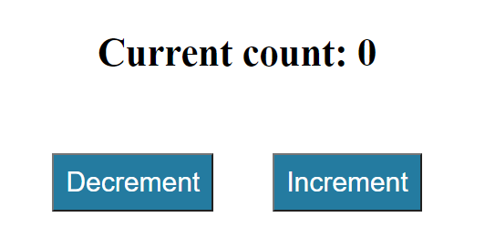

# JS-Counter-App

JavaScript Increment-Decrement Counter App

<!-- Live link to deployed app -->

Repository: https://github.com/Mdudzik92/JS-Counter-App 
Deployed app: https://mdudzik92.github.io/js-counter-app/

<!-- Technologies used -->

JavaScript, HTML, DOM Manipulation

<!-- Explanation of what the app is -->

This is a simple JavaScript app where the user is able to click an increment button or a decrement button, raising the number one at a time. It was created with the addEventListener function and through changing the markup on the HTML via traversing the DOM. An if statement was included to discontinue the decrement once the number reaches 0.

<!-- Screenshot -->

<!-- License -->

MIT

<!-- Contact information -->

Email: mdudzik92@gmail.com
